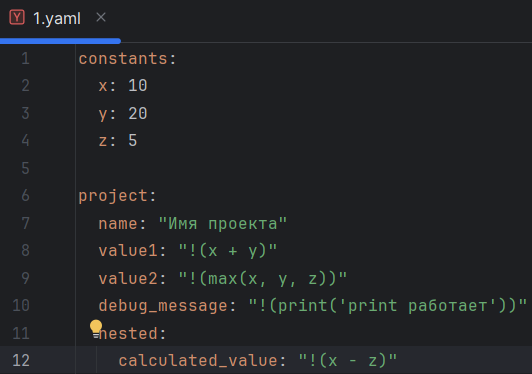

# Конвертер YAML в конфигурационный язык

Это инструмент командной строки для преобразования текста из формата YAML в учебный конфигурационный язык. Инструмент принимает YAML-файл с описанием данных, преобразует их в указанный синтаксис, проверяет наличие синтаксических ошибок и сообщает о них.

---

## Установка и запуск

### 1. Клонируйте репозиторий:
```commandline
git clone https://github.com/AleksUon/Configuration-management-3
```

Для windows
```commandline
python -m venv venv
.\venv\Scripts\activate
pip install pyyaml
```
Для linux/UNIX/MAC
```commandline
python -m venv venv
source venv/bin/activate
pip install pyyaml
```

Запуск
```commandline
python main.py <путь_к_YAML_файлу>
```

Пример 
```commandline
python main.py 1.txt
```

# Аргументы командной строки

* input_file_path: Путь к YAML-файлу, содержащему входные данные.

Пример файла `config.yaml`:

```editorconfig
constants:
  x: 10
  y: 20
  z: 5

project:
  name: "Пример проекта"
  value1: "!(x + y)"
  value2: "!(max(x, y, z))"
  debug_message: "!(print('Это сообщение для отладки'))"
  nested:
    calculated_value: "!(x - z)"
```

# Синтаксис языка конфигурации

```editorconfig
Однострочные комментарии:
C Это однострочный комментарий
Словари:
begin
 имя := значение;
 имя := значение;
 имя := значение;
 ...
end
Имена:
[_a-zA-Z][_a-zA-Z0-9]*
Значения:
• Числа.
• Строки.
• Словари.
Строки:
@"Это строка"
Объявление константы на этапе трансляции:
имя is значение;
Вычисление константного выражения на этапе трансляции (инфиксная
форма), пример:
!(имя + 1)
Результатом вычисления константного выражения является значение.
Для константных вычислений определены операции и функции:
1. Сложение.
2. Вычитание.
3. print().
4. max().
```

# Галерея результатов



